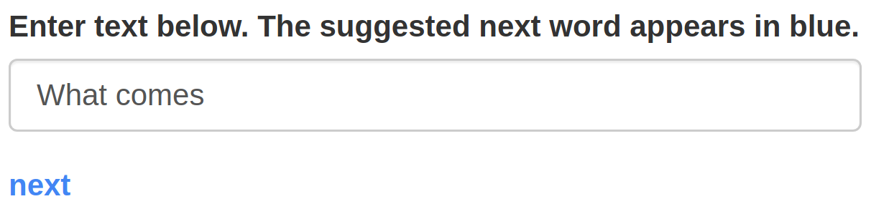

# shiny-text-predictor
What word will be typed next?

## Overview

There are many uses of natural language processing, or nlp.  One key application is the prediction of which word is likely to follow a given phrase or sequence of words in progress.  This project makes use of text scraped from Twitter, from news articles, and from blogs, and analyses which phrases are most common in order to do just that.

This prediction model was built in R using the `ngram` package.  The model works by first reading the last four words typed, and then suggesting which word in the dataset most often follows that particular 4-gram.  If no good suggestion is found, either because that four word phrase is not common enough or because there are not yet four words typed, then it repeats the process using only the last three words typed instead, and so on.

## The App at Work
This screenshot shows the app in action.

